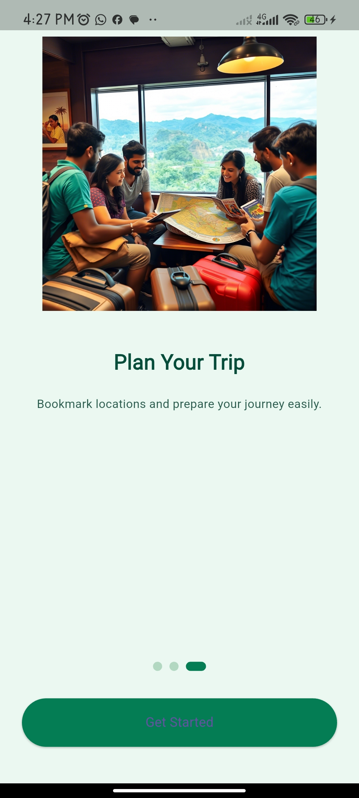
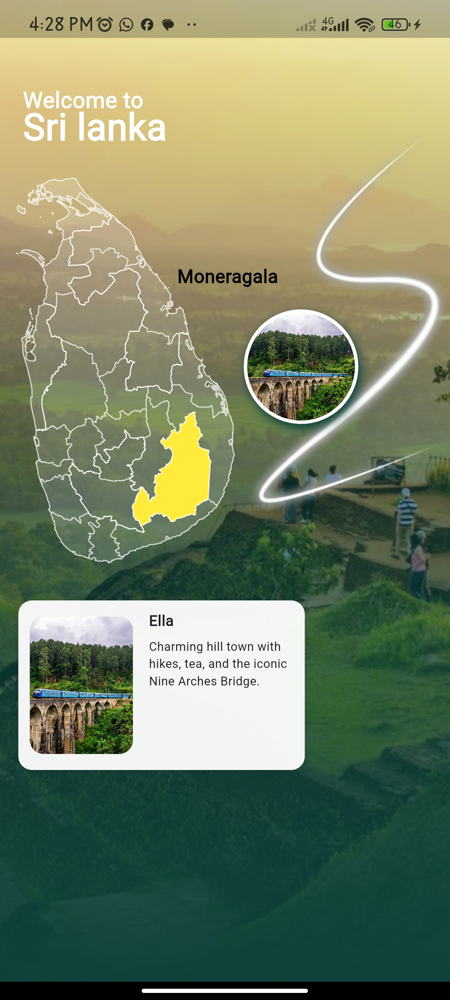
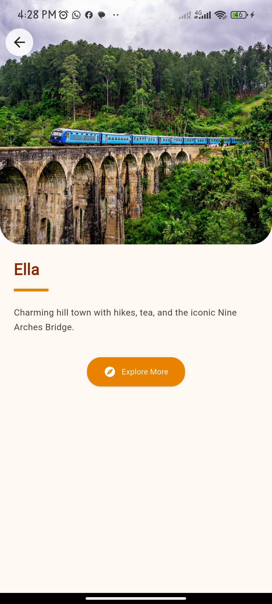

# 🇱🇰 TourSL - Flutter Tourism Guide for Sri Lanka

A beautiful and modern Flutter mobile app that helps users explore tourist destinations across Sri Lanka. Features an onboarding flow, interactive district map using GeoJSON, and detailed pages for tourist cities with images and descriptions.


---

## ✨ Features

- 🧭 Onboarding screens shown only once using SharedPreferences
- 🗺️ District selection with interactive GeoJSON-based map (`flutter_map`)
- 🏙️ City cards with images and descriptions
- 🔍 Navigate from district → cities → city detail
- 🎨 Custom UI with gradient overlays and reusable widgets
- ⚙️ BLoC-based state management for map and onboarding logic

---

## 📸 Screenshots

|  |  |  |  |
|-----------|----------|-----------|--------------|
|  |  |  |  |

---

## 📦 Tech Stack

- **Flutter**
- `flutter_bloc` – BLoC state management
- `flutter_map` – Render district polygons
- `shared_preferences` – Store onboarding status
- `latlong2` – Geographic utilities

---

## 🚀 Getting Started

1. Clone the repo:
   ```bash
   git clone https://github.com/your-username/toursl.git
   cd toursl
